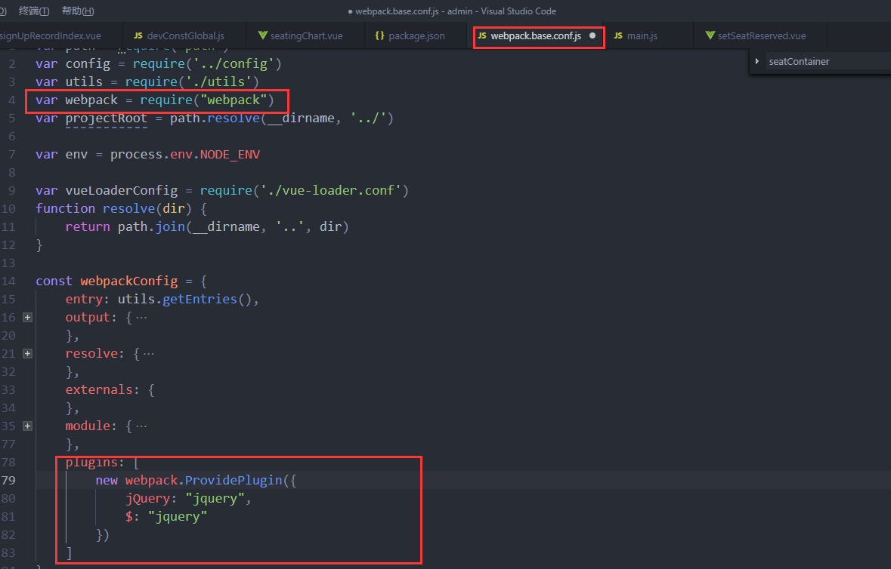

## vue中引入jquery

####    1、安装jquery
``` 
npm install jquery 
```

####    2、在webpack.base.conf.js中配置jquery
#####   引入webpack
```
var webpack = require("webpack")
```

#####   在module.exports的最后添加jquery插件
```
pliguns:[
    new webpack.ProvidePlugin({
        jQuery : "jquery",
        $ : "jquery"
    })
]
```


####    3、在main.js中引入
```
import $ from "jquery"
```

