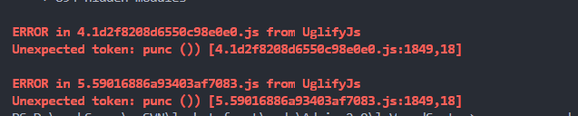
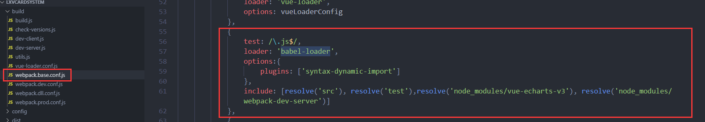

## webpack打包报错：IEcharts、UglifyJs

> ### 问题：项目打包时报以下错误：

 

 > ### 问题原因：UglifyJs打包压缩时不能识别IEcharts中ES6的语法

 > ### 解决方法：

 

 #### 在webpack.base.conf.js中修改
 ``` js
 {
    test: /\.js$/,
    loader: 'babel-loader',
    options:{
        plugins: ['syntax-dynamic-import']
    },
    include: [resolve('src'), resolve('test'),resolve('node_modules/vue-echarts-v3'), resolve('node_modules/webpack-dev-server')]
}
 ```
