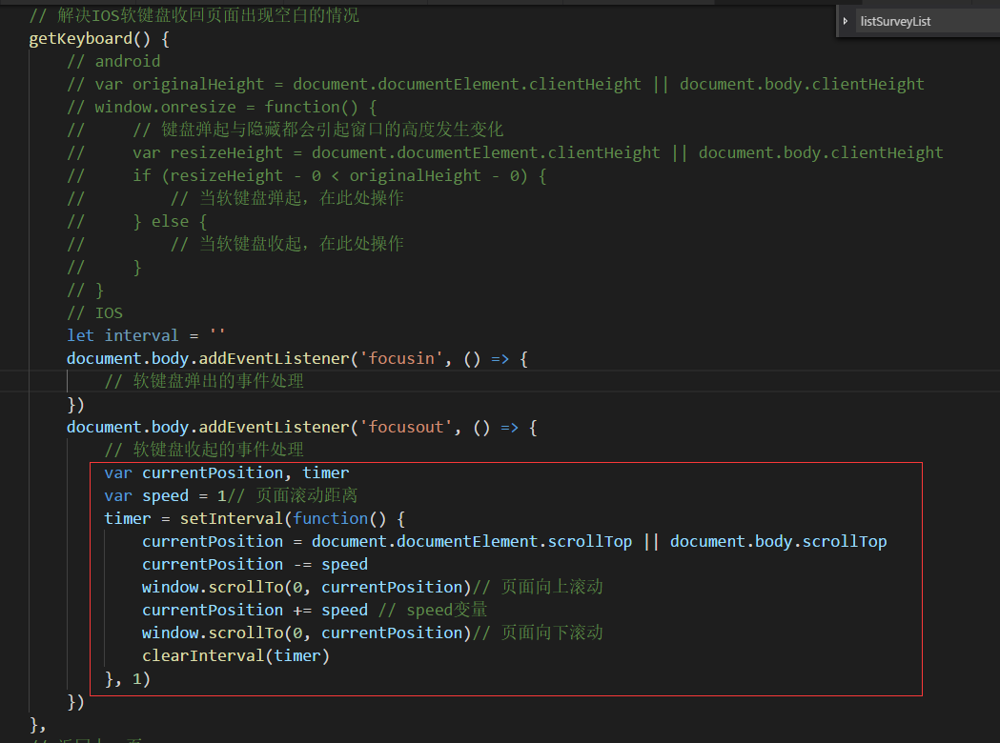

## IOS软键盘收回页面出现空白

> 问题出现条件：iphone手机、IOS12系统、微信v6.7.4及以上的版本；
>
> 问题现象：输入框获取焦点，键盘弹起，页面整体往上滚动，当键盘收起后，不会到原位，导致键盘原来所在的位置是空白的；
>
> 问题原因：此问题为微信已知问题，待修复；

#### 已知解决方法：

> ##### 参考网址：https://blog.csdn.net/qq_23370345/article/details/84757505
> ##### 参考网址： https://segmentfault.com/a/1190000018959389